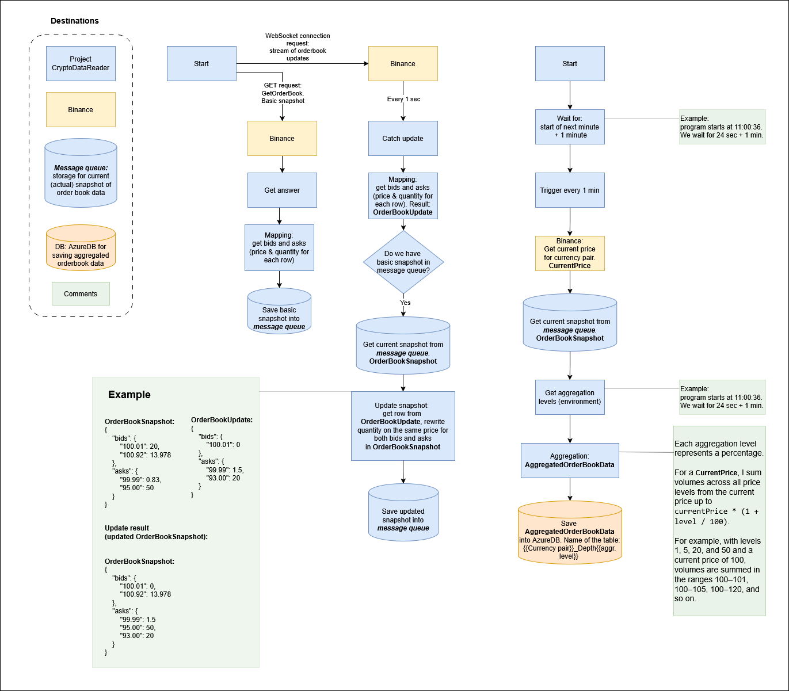

# CryptoCurrencyDataReader

## Table of contents

[1. Introduction](#1-introduction)

[2. Domain](#2-domain)

&nbsp;&nbsp;[2.1 Description](#21-description)

&nbsp;&nbsp;[2.2 Features](#22-features)

[3. Architecture](#3-architecture)

[4. Technology](#4-technology)

[5. How to Run](#5-how-to-run)

## 1. Introduction

The purpose of this repository is to learn and practice a technology that is not my primary stack by applying it to a domain I am genuinely interested in — automated trading.

This project is primarily educational, but it is designed with real-world constraints in mind. If it eventually proves to have monetization potential, that would be a valuable bonus rather than the main goal.

## 2. Domain

### 2.1 Description

Automated trading is often seen as a way to build systems that can operate with minimal human involvement. There are many existing platforms that allow users to configure strategies through graphical interfaces and run them on managed infrastructure.

This project takes a different approach. It focuses on building a simple automated trading system using self-managed infrastructure and fully custom logic implemented by me.

In short, the system collects aggregated order book data from a cryptocurrency exchange (currently Binance). Based on the collected data, Python scripts can be executed to run trading strategies and perform backtesting. As a result, the system places buy and sell orders for selected crypto pairs and automatically manages them using exchange-side Stop Loss and Take Profit mechanisms.

### 2.2. Features

 - **Feature 1. Order Book Data Collection & Storage**
The system retrieves real-time order book data for selected cryptocurrency pairs from Binance, aggregates it according to predefined rules, and stores the processed market data in a database for further analysis and trading.

 - **Feature 2. Strategy Execution & Trading Engine**
The system provides access to historical aggregated market data for a selected time range, order book depth, and trading pair. This enables the development and backtesting of trading strategies in Python, as well as real-time strategy execution with automated order placement and integrated risk management mechanisms such as Stop Loss, Take Profit, and Grid Trading.

 - **Feature 3. User Notifications**
The system notifies users about changes in trading positions and order states in real time via Telegram.

## 3. Architecture

The system is built as a set of loosely coupled components focused on market data collection, strategy execution, and automated trading.

At a high level, the architecture consists of four main parts:
market data ingestion, data storage, strategy execution, and user notifications.

Market data is sourced directly from the cryptocurrency exchange (Binance) via WebSocket connections. A dedicated Crypto Data Collector application is responsible for receiving raw order book updates, aggregating them according to predefined rules, and producing consistent market snapshots.

The aggregated data is handled in two ways:

the latest snapshot is temporarily stored in a message queue for fast access;

periodic snapshots are persisted in a snapshot database for historical analysis and strategy backtesting.

An Automated Trading Function consumes the aggregated market data to test strategies on historical data and to execute them in real time. Based on strategy logic, it places buy and sell orders on the exchange and manages positions using exchange-side risk management mechanisms such as Stop Loss and Take Profit.

User-facing feedback is handled via a notification subsystem. Trading events, order state changes, and position updates are sent to users through Telegram, providing near real-time visibility into system activity.

The entire infrastructure is hosted in the cloud (Azure), which is used for running system components and storing collected market data. This setup allows the system to remain modular, extensible, and suitable both for experimentation and realistic trading scenarios.

##### Crypto data collector App Diagram

## 4. Technology

To be done.

## 5. How to Run